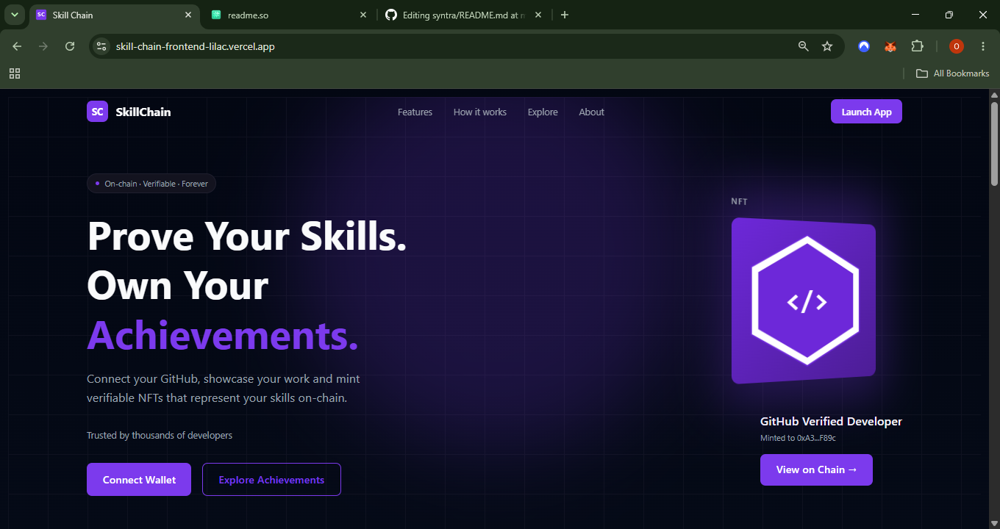

# Skill Chain

A platform that turns your GitHub contribution history into on-chain soulbound NFT credentials. Connect your GitHub account, index your repositories, earn achievements based on your activity, and mint non-transferable NFT credentials on Sepolia.

**Live site:** 
## Live Preview
[](https://skill-chain-frontend-lilac.vercel.app/)

---

## Why Skill Chain

Developer reputation today is fragile — it lives on centralized platforms, exposes raw activity data, and can't be independently verified. Skill Chain is a decentralized identity and achievement protocol that changes that.

- **GitHub activity is verified on-chain** — your contributions aren't just self-reported
- **Skills are minted as soulbound NFTs** — non-transferable credentials tied to your wallet
- **Reputation scores live on-chain** — portable across any platform that reads the chain
- **Privacy-first** — instead of exposing raw GitHub data, you prove what you've done without revealing everything behind it (FHE roadmap)
- **Others can verify skills on-chain** — no middleman, no platform lock-in

> Privacy-first reputation for builders.

---

## Architecture

```
                        ┌─────────────────────────────────┐
                        │          User Browser            │
                        │                                  │
                        │   Next.js Frontend (Vercel)      │
                        │   - RainbowKit / wagmi / viem    │
                        │   - NextAuth (GitHub OAuth)      │
                        │   - TanStack Query               │
                        └──────┬──────────┬───────────────┘
                               │          │
               REST API calls  │          │  GraphQL queries
                               │          │
                    ┌──────────▼──┐   ┌───▼────────────────┐
                    │   Backend   │   │   The Graph        │
                    │  (Railway)  │   │   Subgraph         │
                    │             │   │                    │
                    │  Express    │   │  Indexes on-chain  │
                    │  ethers.js  │   │  NFT mint/revoke   │
                    │  Pinata     │   │  proof events      │
                    └──────┬──────┘   └────────────────────┘
                           │                    ▲
                  DB reads │                    │ Contract events
                  & writes │                    │
                    ┌──────▼──────┐   ┌─────────┴──────────┐
                    │  Supabase   │   │  Sepolia Blockchain │
                    │             │   │                    │
                    │  users      │   │  ProofVerifier     │
                    │  nonces     │   │  SoulboundNft      │
                    │  achievements│  │                    │
                    │  user_      │   └────────────────────┘
                    │  achievements│           ▲
                    └─────────────┘           │
                                              │ Contract calls
                                              │ (wagmi/viem)
                                    ┌─────────┴──────────┐
                                    │   User Browser     │
                                    │   (same frontend)  │
                                    └────────────────────┘
```

### Flow Breakdown

**Authentication**
- User must connect both **GitHub** (via NextAuth OAuth) and a **wallet** (via RainbowKit) before accessing the dashboard or minting
- The wallet address is linked to the GitHub session and synced via a cookie for SSR

**GitHub Indexing**
- On login the backend fetches the user's repos and commits via the GitHub GraphQL API
- Repos and commit counts are used to calculate a developer score
- If the user has at least **10 repositories** they automatically earn their first achievement on login

**Achievement Claiming**
- Frontend calls `GET /api/nonce` to get a one-time nonce from the backend
- User signs a message containing their user ID, wallet address, and nonce with their wallet
- Frontend sends the signed message to `POST /api/sign-proof`
- Backend verifies the wallet signature, consumes the nonce, and returns a backend-signed proof
- Frontend submits the proof to the `ProofVerifier` contract on-chain using wagmi/viem

**NFT Minting**
- Frontend calls `POST /api/mint` with the user's stats and achievement ID
- Backend uploads NFT metadata (name, description, image, attributes) to **IPFS via Pinata**
- Backend calls `SoulboundNft.issue()` on-chain using the minter wallet
- The minted token is non-transferable and tied to the user's wallet forever

**On-chain Indexing**
- The Graph subgraph listens to `Issued` and `Revoked` events from `SoulboundNft`
- Frontend queries the subgraph via GraphQL to display the user's minted NFTs

**Database (Supabase)**
- Stores users, nonces, achievements, and user achievement records
- Backend is the only service that reads/writes to Supabase directly
- Frontend never touches Supabase — all DB access goes through the backend API

---

## Achievements

Achievements are unlocked based on your GitHub activity and minted as soulbound NFTs on-chain.

| Achievement | Criteria |
|-------------|----------|
| First Login  | GitHub Account connected |
| Has 10 Repos | Connect GitHub with at least 10 repositories |


More achievements are unlocked based on commit count, repo count, and developer score. Each achievement can only be claimed once per wallet and is non-transferable.

---

## How It Works

1. **Connect** — Sign in with GitHub and connect your wallet
2. **Index** — Your repositories and commits are fetched via the GitHub GraphQL API
3. **Earn** — Achievements are unlocked based on your repo count, commit count, and score
4. **Claim** — Sign a message with your wallet to request a backend-signed proof
5. **Mint** — Submit the proof on-chain and receive a soulbound NFT credential

---

## Monorepo Structure

```
my-app/
├── packages/
│   ├── frontend/     # Next.js 15 app (deployed to Vercel)
│   ├── backend/      # Express API (deployed to Railway)
│   ├── contract/     # Solidity contracts (deployed to Sepolia)
│   ├── indexer/      # GitHub indexer + The Graph subgraph
│   └── shared/       # Shared types, ABIs, config, addresses
├── turbo.json
├── pnpm-workspace.yaml
└── vercel.json
```

---

## Packages

| Package | Description | Docs |
|---------|-------------|------|
| `@my-app/frontend` | Next.js frontend with RainbowKit, wagmi, NextAuth | [README](packages/frontend/README.md) |
| `@my-app/backend` | Express API for proof signing, minting, and Supabase | [README](packages/backend/README.md) |
| `@my-app/contract` | `ProofVerifier` and `SoulboundNft` Solidity contracts | [README](packages/contract/README.md) |
| `@my-app/indexer` | GitHub GraphQL indexer and The Graph subgraph | [README](packages/indexer/README.md) |
| `@my-app/shared` | Shared TypeScript types, ABIs, addresses, config | [README](packages/shared/README.md) |

---

## Deployed Contracts (Sepolia)

| Contract | Address |
|----------|---------|
| `ProofVerifier` | `0xfa4ecd7e60a06567c5d16e7fcb05c46f479d0451` |
| `SoulboundNft` | `0xb22f6d60c49f325813185c77b8a5b3b23eb130e6` |

---

## Live Services

| Service | URL |
|---------|-----|
| Frontend | https://skill-chain-frontend-lilac.vercel.app |
| Backend | https://my-appbackend-production.up.railway.app |
| Subgraph | https://api.studio.thegraph.com/query/1749766/skill-chain/version/latest |

---

## Tech Stack

- **Frontend** — Next.js 15, RainbowKit, wagmi, NextAuth, TanStack Query, Tailwind CSS v4
- **Backend** — Express, ethers.js, Supabase, Pinata (IPFS)
- **Contracts** — Solidity, Foundry, OpenZeppelin
- **Indexer** — The Graph, GitHub GraphQL API
- **Monorepo** — pnpm workspaces, Turborepo

---

## Prerequisites

- Node.js 18+
- pnpm 10+
- Foundry (for contract development)

---

## Getting Started

### 1. Install dependencies

```bash
pnpm install
```

### 2. Set up environment variables

**`packages/frontend/.env.local`**
```env
NEXTAUTH_URL=http://localhost:3000
NEXTAUTH_SECRET=
GITHUB_ID=
GITHUB_SECRET=
NEXT_PUBLIC_BACKEND_URL=http://localhost:3002
NEXT_PUBLIC_WALLETCONNECT_PROJECT_ID=
NEXT_PUBLIC_GRAPH_URL=https://api.studio.thegraph.com/query/1749766/skill-chain/version/latest
```

**`packages/backend/.env`**
```env
PORT=3002
NEXTAUTH_SECRET=
SIGNER_PRIVATE_KEY=
MINTER_PRIVATE_KEY=
SUPABASE_URL=
SUPABASE_SERVICE_ROLE_KEY=
SEPOLIA_RPC_URL=
PINATA_API_KEY=
PINATA_SECRET_KEY=
FRONTEND_URL=http://localhost:3000
```

### 3. Run locally

```bash
# Run frontend and backend together
pnpm dev

# Or run individually
pnpm --filter frontend dev
pnpm --filter @my-app/backend dev
```

---

## Building

```bash
pnpm build
```

Turborepo builds all packages in the correct order — `shared` first, then `backend` and `frontend` in parallel.

---

## Deployment

| Package | Platform | Trigger |
|---------|----------|---------|
| `frontend` | Vercel | Push to `main` (watches `packages/frontend/**` and `packages/shared/**`) |
| `backend` | Railway | Push to `main` (watches `packages/backend/**` and `packages/shared/**`) |
| `contract` | Sepolia via Foundry | Manual (`pnpm deploy:sepolia`) |
| `indexer` | The Graph Studio | Manual (`pnpm graph:deploy`) |

See individual package READMEs for detailed deployment instructions.

---

## Contributing

Contributions are welcome! Here's how to get started.

### 1. Clone the repo

```bash
git clone https://github.com/somtech123/skill-chain.git
cd skill-chain/my-app
```

### 2. Install dependencies

```bash
pnpm install
```

### 3. Set up environment variables

Copy the example env vars from the Getting Started section above into:
- `packages/frontend/.env.local`
- `packages/backend/.env`
- `packages/contract/.env` (for deployment)

### 4. Create a branch

```bash
git checkout -b feat/your-feature-name
# or
git checkout -b fix/your-bug-fix
```

Branch naming conventions:
- `feat/` — new feature
- `fix/` — bug fix
- `chore/` — maintenance, refactoring
- `docs/` — documentation updates

### 5. Make your changes

Run the relevant package locally while developing:

```bash
pnpm --filter frontend dev      # frontend on localhost:3000
pnpm --filter @my-app/backend dev  # backend on localhost:3002
```

### 6. Build and lint before pushing

```bash
pnpm build
pnpm lint
```

### 7. Commit and push

```bash
git add .
git commit -m "feat: describe your change"
git push origin feat/your-feature-name
```

Commit message conventions:
- `feat:` — new feature
- `fix:` — bug fix
- `chore:` — maintenance
- `docs:` — documentation
- `refactor:` — code restructure without behavior change

### 8. Open a Pull Request

Go to https://github.com/somtech123/skill-chain and open a PR against `main`. Describe what you changed and why.

---

## Managing Packages

### Add a dependency to a specific package

```bash
# Add to frontend only
pnpm add <package> --filter frontend

# Add to backend only
pnpm add <package> --filter @my-app/backend

# Add a dev dependency
pnpm add -D <package> --filter frontend
```

### Add a dependency to the root workspace

```bash
# Runtime dependency
pnpm add <package> -w

# Dev dependency (most common for root — turbo, typescript, etc.)
pnpm add -D <package> -w
```

### Add a local workspace package as a dependency

To use `@my-app/shared` inside another package:

```bash
pnpm add @my-app/shared --filter @my-app/backend --workspace
```

Or manually add to the package's `package.json` and run `pnpm install`:

```json
{
  "dependencies": {
    "@my-app/shared": "workspace:*"
  }
}
```

### Remove a dependency

```bash
pnpm remove <package> --filter frontend
```

### Update a dependency

```bash
# In a specific package
pnpm update <package> --filter frontend

# Across all packages
pnpm update <package> -r
```

### Run a script in a specific package

```bash
pnpm --filter frontend dev
pnpm --filter @my-app/backend build
pnpm --filter @my-app/contract test
```

### Run a script across all packages

```bash
pnpm -r build
pnpm -r lint
```

---

## License

MIT
